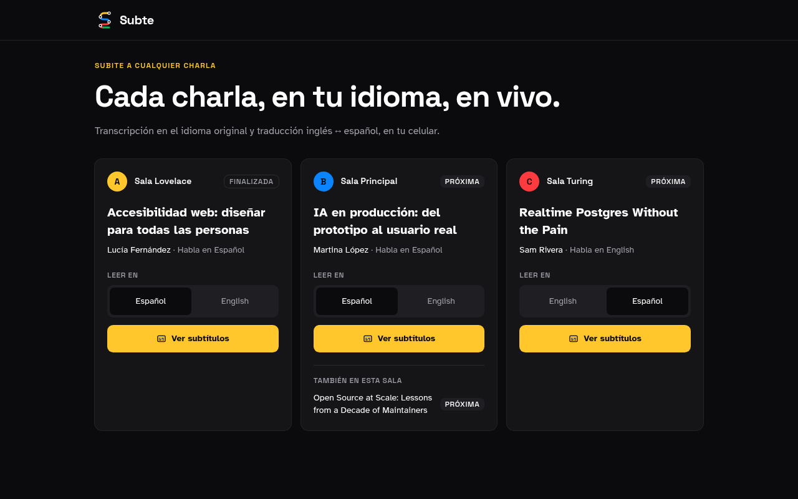
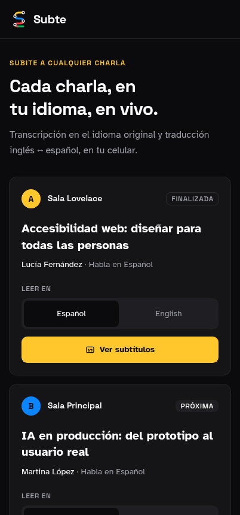
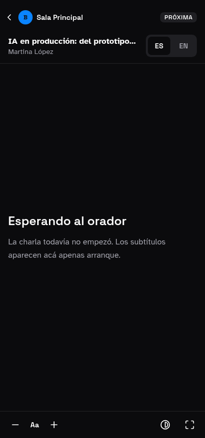
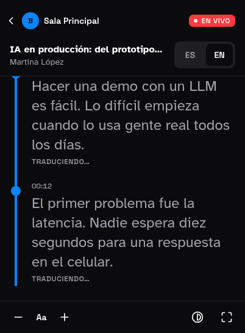
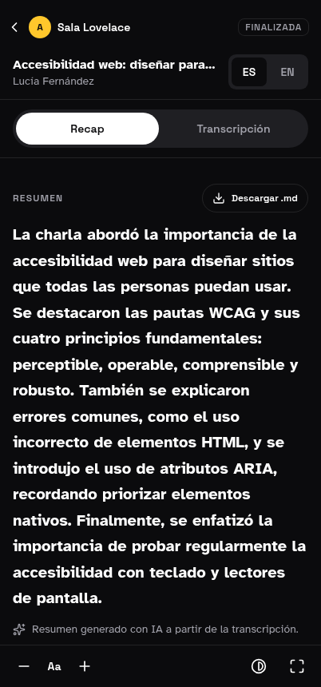
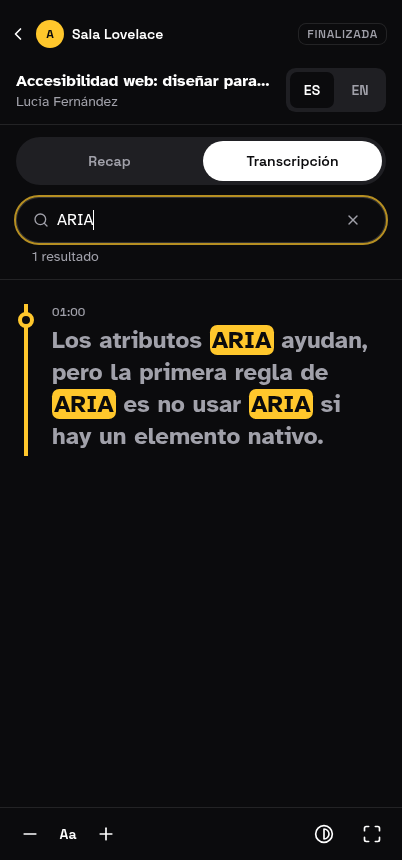
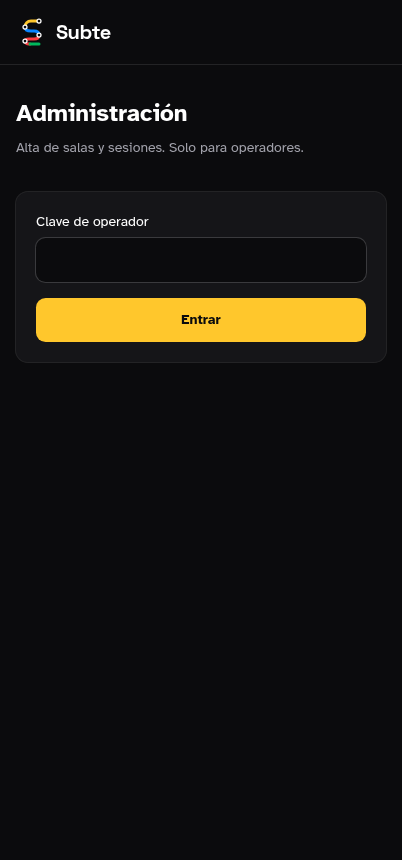

<p align="center">
  
</p>

<h3 align="center">Subtítulos en vivo y traducción EN↔ES para conferencias con muchas salas en paralelo.</h3>

<p align="center">
  <a href="https://subte-nerdearla.vercel.app">Demo</a> · <a href="#probalo-en-5-minutos">Probalo en 5 minutos</a> · <a href="#demo-en-capturas">Capturas</a> · <a href="docs/DEPLOY.md">Despliega el tuyo</a> · <a href="docs/ARCHITECTURE.md">Arquitectura</a>
</p>

<p align="center">
  <a href="LICENSE"></a>
  
  
  
  
</p>

> **Estado del proyecto:** MVP funcional. Ya se puede transmitir una charla desde el celular de la sala (con micrófono o con una simulación) y el público la sigue en vivo, traducida, desde su celular. Al terminar, la IA genera un **recap** con resumen, ideas principales y capítulos navegables. Notas personales y Deepgram están en el [Roadmap](#roadmap).

## Índice

- [El problema](#el-problema)
- [La solución](#la-solución)
- [Probalo en 5 minutos](#probalo-en-5-minutos)
- [Demo en capturas](#demo-en-capturas)
- [Funcionalidades](#funcionalidades)
- [Cómo funciona](#cómo-funciona)
- [Modelo de datos](#modelo-de-datos)
- [API](#api)
- [Stack](#stack)
- [Instalación y despliegue](#instalación-y-despliegue)
- [Variables de entorno](#variables-de-entorno)
- [Estructura del repositorio](#estructura-del-repositorio)
- [Seguridad](#seguridad)
- [Accesibilidad y privacidad](#accesibilidad-y-privacidad)
- [Costos estimados](#costos-estimados)
- [Limitaciones conocidas](#limitaciones-conocidas)
- [Roadmap](#roadmap)

## El problema

Nerdearla tiene más de 30 sesiones en inglés, repartidas en varias salas que corren al mismo tiempo. Para que todo el público pueda seguirlas hacen falta subtítulos en vivo y traducción, y hoy eso se resuelve con herramientas comerciales caras y mucha operación manual. El desafío de la **Vibeathon Nerdearla 2026** es construir una alternativa **open source** que escale a 5, 10 o más escenarios en paralelo y que cualquier conferencia pueda desplegar.

## La solución

**Subte** es una plataforma open source de subtítulos en vivo y traducción EN↔ES. La metáfora es el subte:

- **Cada sala es una línea**, con su color y su letra (A amarilla, B azul, C roja, D verde…).
- **La agenda es el mapa de la red**: elegís la línea y te subís a la charla que está sonando.
- **Cada frase es una estación**: la transcripción se dibuja como un recorrido, y la estación más nueva late mientras la charla está en vivo.

El público no instala nada: abre la web en el celular, elige la charla y el idioma. En cada sala alcanza con **un celular** apoyado cerca del parlante o del orador.

## Probalo en 5 minutos

No hace falta micrófono: la estación de sala trae una **simulación** con dos charlas de ejemplo (una en inglés y otra en español) que recorren todo el pipeline real, incluida la traducción.

1. Entrá a **`/admin`** e ingresá la clave de operador (`OPERATOR_KEY`).
2. En el listado de sesiones, tocá **Estación** en cualquier charla (por ejemplo _IA en producción_). Se abre `/stage/[slug]`.
3. Dejá la fuente en **Simulación** y tocá **Transmitir**. La sesión pasa a _En vivo_ y la agenda la marca como tal.
4. Tocá **Abrir vista del público** (o copiá el enlace y abrilo en otro celular).
5. En la vista del público vas a ver aparecer cada frase en el idioma original y, uno o dos segundos después, su traducción. Cambiá el idioma con el selector **ES / EN**.
6. Para probar con voz real, elegí **Micrófono** en la estación (Chrome, Edge o Safari) y hablá.
7. Al terminar, **Finalizar** cierra la charla y genera el **recap** automáticamente; la vista del público pasa a mostrar _Recap_ y _Transcripción_. **Reiniciar** borra la transcripción para volver a empezar.

**Atajo para la demo:** en `/admin`, el panel **Modo demo: todas las salas en vivo** pone una charla por sala a transmitir la simulación al mismo tiempo, así la agenda se ve con varias líneas en vivo. **Detener demo** corta la simulación.

## Demo en capturas

No hay video, así que este es el recorrido completo en capturas. Están tomadas con un navegador headless sobre la app real en modo oscuro; las de celular miden 402 px de ancho. Todas están en [`docs/screenshots/`](docs/screenshots).

### 1. Agenda: el mapa de la red

Cada sala es una línea con su color y su letra. Cada tarjeta muestra la charla actual, el estado (_En vivo_, _Próxima_, _Finalizada_), el idioma del orador y el selector **Leer en**.

<p align="center">
  
</p>

<p align="center">
  
</p>

### 2. Vista del público antes de empezar

Si la charla todavía no arrancó, la vista lo avisa. Los subtítulos aparecen solos cuando la sala empieza a transmitir, sin recargar la página.

<p align="center">
  
</p>

### 3. Subtítulos en vivo con traducción

Con la charla _En vivo_, cada frase es una estación del recorrido. Primero aparece en el idioma original y, uno o dos segundos después, su traducción; mientras tanto la estación muestra _Traduciendo…_. El selector **ES / EN** cambia el idioma al instante. La barra inferior ajusta el tamaño de letra, el contraste y la pantalla completa.

<p align="center">
  
</p>

### 4. Recap con IA al finalizar

Cuando termina la charla, la vista cambia a **Recap** y **Transcripción**. El recap trae el resumen, las ideas principales y los capítulos navegables, en los dos idiomas. **Descargar .md** exporta el recap y la transcripción en Markdown.

<p align="center">
  
</p>

### 5. Búsqueda en la transcripción

La pestaña **Transcripción** tiene un buscador que resalta las coincidencias y muestra la marca de tiempo de cada frase.

<p align="center">
  
</p>

### 6. Acceso de operadores

`/admin` y `/stage/[slug]` piden la clave de operador. Adentro están el alta de salas y sesiones, el **Modo demo** y la estación de sala con _Micrófono_ o _Simulación_, _Transmitir_, _Finalizar_ y _Generar recap_. Esas pantallas no están capturadas porque la clave no se expone al navegador headless; para verlas, seguí [Probalo en 5 minutos](#probalo-en-5-minutos).

<p align="center">
  
</p>

## Funcionalidades

### Agenda pública — `/`

- Todas las salas como líneas de colores, con la sesión en vivo o la próxima destacada.
- Estado de cada charla: programada, en vivo o finalizada.
- Selector de idioma (español / inglés) que se recuerda al entrar a la charla.

### Vista del público — `/s/[slug]`

- **Subtítulos en vivo** en el idioma elegido, con el original debajo en gris cuando se muestra una traducción.
- **Texto provisional**: mientras el orador habla, se ve la frase en construcción (en el idioma original) antes de que se confirme.
- **Recorrido tipo subte**: cada frase es una estación con su marca de tiempo; la última late mientras la charla está en vivo.
- **Seguimiento automático** del último subtítulo; si hacés scroll hacia atrás, aparece un botón **Volver al vivo**.
- **Tamaño de letra** ajustable, **alto contraste** y **modo sala** (pantalla completa con la última frase en grande, pensado para proyectar).
- **Indicador de conexión** y reconexión automática. Al entrar tarde, se carga toda la transcripción anterior.
- Si una traducción falla, la frase queda marcada como **Solo original** en lugar de quedarse cargando.
- Anuncios para lectores de pantalla (`aria-live`) con cada frase nueva.

### Recap con IA — `/s/[slug]` al finalizar

- Se genera **automáticamente al finalizar** la charla, en español y en inglés.
- **Resumen** breve, **ideas principales** y **capítulos ("estaciones")** con su hora de inicio; tocar un capítulo salta a ese momento de la transcripción.
- **Buscador** en la transcripción, con resaltado de coincidencias.
- **Descarga en Markdown** del recap y la transcripción completa.
- Mientras se genera, la vista muestra un estado de espera y se actualiza sola cuando está listo.

### Estación de sala — `/stage/[slug]` (solo operadores)

- **Dos fuentes**: _Simulación_ (guion de ejemplo según el idioma de la charla) o _Micrófono_ (Web Speech API del navegador, `es-AR` / `en-US`).
- **Transmitir, Pausar, Finalizar y Reiniciar**, con confirmación en las acciones destructivas.
- Reloj de la charla, frases enviadas, frases fallidas y **latencia** de la última frase (guardado + traducción).
- Lista de las últimas frases enviadas y los idiomas a los que se tradujeron; las que quedaron sin traducción se marcan.
- Botón **Generar recap** para rehacerlo después de finalizar.
- Enlace para abrir o copiar la vista del público.
- Reinicio automático del reconocimiento de voz cuando el navegador lo corta, y avisos claros si falta permiso de micrófono o el navegador no lo soporta.

### Panel de operadores — `/admin`

- Acceso con una clave compartida (`OPERATOR_KEY`), guardada en una cookie `httpOnly`.
- Alta de salas y de sesiones: slug, título, orador, sala, idioma original y **glosario** (términos que la traducción debe respetar, como `Kubernetes` o `RAG`).
- Listado de sesiones con acceso directo a la **Estación** y a la **Vista del público**.
- **Modo demo**: todas las salas en vivo con la simulación, con un clic.

### Traducción

- Traducción frase por frase con **AI SDK** a través de **Vercel AI Gateway** (modelo `google/gemini-2.5-flash-lite`, el mismo que genera el recap; se configura en `lib/live/gateway.ts`).
- Usa las **dos frases anteriores como contexto** para que la traducción sea coherente, sin volver a traducirlas.
- Respeta el **glosario** de la sesión, nombres de productos, siglas y código.
- Español **rioplatense** como variante de destino.
- Timeout de 8 s por traducción; los errores quedan en la tabla `logs` y no frenan la transcripción.

## Cómo funciona

```
 Celular en la sala (/stage)
   ├─ Micrófono (Web Speech API) ─┐
   └─ Simulación (guion)  ────────┤
                                  │ frase provisional ─────────────┐
                                  │ frase final                    │
                                  ▼                                │
          Server Action (sesión de operador)                       │
                                  │                                │
                    ┌─────────────┴──────────────┐                 │
                    ▼                            ▼                 ▼
        Supabase Postgres              AI Gateway (traducción)   Supabase Realtime
        segments / translations  ◀──── EN↔ES con contexto ────▶  Broadcast  live:{sessionId}
                                                                   │
                                                                   ▼
                                                  Celulares del público (/s/[slug])
```

Recorrido de una frase:

1. **Captura.** La estación reconoce la voz (o lee el guion de simulación). Mientras la frase está incompleta, envía eventos `interim` que se difunden sin guardarse.
2. **Ingesta.** Cuando la frase se confirma, la estación llama a la Server Action `pushSegmentAction`. La frase se guarda en `segments` con un `upsert` por `(session_id, seq)`, así que reintentar no duplica nada.
3. **Difusión del original.** El servidor publica un evento `segment` en el canal `live:{sessionId}` usando la API REST de Supabase Realtime (no hace falta mantener un socket abierto por request).
4. **Traducción.** En paralelo para cada idioma destino, se traduce con contexto y glosario, se guarda en `translations` y se publica un evento `translation`.
5. **Vista del público.** Cada celular está suscripto al canal de la charla. Une segmentos y traducciones por `seq` (aunque la traducción llegue antes que el segmento) y, al conectarse, carga la transcripción completa desde `GET /api/sessions/[slug]/transcript` con SWR.

Eventos del canal `live:{sessionId}` (validados con zod en `lib/schemas.ts`):

| Evento | Cuándo se envía |
|---|---|
| `interim` | Frase provisional mientras el orador habla |
| `segment` | Frase confirmada y guardada |
| `translation` | Traducción de una frase a un idioma |
| `status` | La charla pasa a `live` o `ended` |
| `reset` | El operador borró la transcripción |

Más detalle en [docs/ARCHITECTURE.md](docs/ARCHITECTURE.md).

## Modelo de datos

Supabase Postgres, con Row Level Security en todas las tablas. Scripts en `scripts/`.

| Tabla | Contenido | Acceso público |
|---|---|---|
| `stages` | Salas | Lectura |
| `sessions` | Charlas: slug, título, orador, sala, idioma original, idiomas destino, glosario, estado, horarios | Lectura |
| `segments` | Frases confirmadas: `seq`, idioma, texto, `t_start_ms`, `t_end_ms` | Lectura |
| `translations` | Traducción de cada segmento por idioma | Lectura |
| `session_insights` | Recap por idioma: resumen, ideas principales y capítulos | Lectura |
| `notes` | Notas y marcadores personales _(planificado)_ | Solo las propias |
| `logs` | Eventos y errores del servidor | Ninguno |

Todas las escrituras de segmentos, traducciones y estados pasan por el servidor con la clave service role, después de verificar la sesión de operador.

## API

| Método | Ruta | Auth | Descripción |
|---|---|---|---|
| `GET` | `/api/sessions/[slug]/transcript` | Pública | Estado de la charla y transcripción completa con traducciones. Sin caché. |
| `GET` | `/api/sessions/[slug]/recap` | Pública | Recap de la charla por idioma (resumen, ideas principales, capítulos). Sin caché. |
| `POST` | `/api/segments` | Header `x-operator-key` o cookie de operador | Ingesta de una frase desde estaciones externas (scripts, hardware). |

Ejemplo de ingesta externa:

```bash
curl -X POST https://tu-dominio.vercel.app/api/segments \
  -H "Content-Type: application/json" \
  -H "x-operator-key: $OPERATOR_KEY" \
  -d '{
    "sessionId": "00000000-0000-4000-b000-000000000001",
    "seq": 1,
    "lang": "en",
    "text": "Hi everyone, thanks for coming.",
    "tStartMs": 0,
    "tEndMs": 2400
  }'
# → { "ok": true, "id": "…", "translated": ["es"] }
```

Respuestas de error: `400 invalid_input`, `401 unauthorized`, `404 not_found`, `500 db_error`. Referencia completa en [docs/API.md](docs/API.md).

## Stack

- **Next.js 16** (App Router, Server Actions, React 19) + **TypeScript**, desplegado en **Vercel**.
- **Supabase**: Postgres con RLS y **Realtime Broadcast**.
- **AI SDK 7** + **Vercel AI Gateway** para la traducción y el recap.
- **Web Speech API** del navegador para la transcripción en el MVP (Deepgram Nova-3 planificado).
- **SWR** para la carga inicial y la resincronización de la transcripción.
- **Tailwind CSS v4** + **shadcn/ui**, **zod** para validación, **lucide-react** para íconos.
- Construido con **v0** desde un celular.

## Instalación y despliegue

1. Hacé un fork de este repositorio.
2. Creá un proyecto en [Supabase](https://supabase.com).
3. En el SQL Editor, ejecutá en orden `scripts/001_schema.sql`, `scripts/002_rls.sql` y (opcional) `scripts/003_seed.sql`, que carga 3 salas y 4 charlas de ejemplo.
4. Importá el repositorio en [Vercel](https://vercel.com/new).
5. Cargá las [variables de entorno](#variables-de-entorno).
6. Desplegá, entrá a `/admin` con tu clave y seguí los pasos de [Probalo en 5 minutos](#probalo-en-5-minutos).

Desarrollo local:

```bash
pnpm install
cp .env.example .env.local   # completá los valores
pnpm dev                     # http://localhost:3000
```

Guía completa: [docs/DEPLOY.md](docs/DEPLOY.md). Operación durante el evento: [docs/OPERATOR_GUIDE.md](docs/OPERATOR_GUIDE.md).

## Variables de entorno

| Variable | Tipo | Uso |
|---|---|---|
| `NEXT_PUBLIC_SUPABASE_URL` | Pública | URL del proyecto de Supabase |
| `NEXT_PUBLIC_SUPABASE_ANON_KEY` | Pública | Clave anónima; el acceso está limitado por RLS |
| `SUPABASE_SERVICE_ROLE_KEY` | **Secreta** | Escrituras del servidor y publicación en Realtime. Nunca se envía al navegador |
| `OPERATOR_KEY` | **Secreta** | Clave compartida de operadores. Generala con `openssl rand -base64 32` |
| `VERCEL_AI_GATEWAY_KEY` | **Secreta, opcional** | API key de AI Gateway. Si no está, se usa `AI_GATEWAY_API_KEY` u OIDC |

## Estructura del repositorio

```
app/
  page.tsx                          Agenda (/)
  admin/                            Panel de operadores: página y Server Actions
  s/[slug]/page.tsx                 Vista del público
  stage/[slug]/page.tsx             Estación de sala
  stage/actions.ts                  Server Actions: iniciar, finalizar, reiniciar, enviar frases, recap, modo demo
  api/segments/route.ts             Ingesta externa de frases
  api/sessions/[slug]/transcript/   Transcripción completa de una charla
  api/sessions/[slug]/recap/        Recap de una charla
components/
  admin/                            Formularios, listado y modo demo del panel
  agenda/                           Tarjeta de sala, badge de estado, selector de idioma
  viewer/                           Vista del público: subtítulos, recap, buscador, cabecera, ajustes
  stage/station.tsx                 Estación de sala
  brand/                            Marca de Subte en SVG
  ui/                               Componentes de shadcn/ui
lib/
  live/
    ingest.ts                       Guardar, difundir y traducir una frase
    gateway.ts                      Cliente de AI Gateway y modelo compartido
    translate.ts                    Traducción con AI SDK + AI Gateway
    recap.ts                        Generación del recap (resumen, ideas, capítulos)
    recap-read.ts                   Lectura del recap guardado
    export.ts                       Exportación a Markdown
    broadcast.ts                    Publicación en Supabase Realtime desde el servidor
    transcript.ts                   Carga de la transcripción completa
    shared.ts                       Tipos y utilidades compartidas cliente/servidor
  stage/
    speech.ts                       Tipos y acceso a la Web Speech API
    demo-scripts.ts                 Guiones de la simulación (EN y ES)
  supabase/                         Clientes de navegador, servidor y service role
  i18n/                             Textos de la interfaz (es, en)
  schemas.ts                        Contratos zod: eventos en vivo y entrada de segmentos
  operator.ts                       Sesión de operador basada en OPERATOR_KEY
  agenda.ts                         Consulta de salas y sesiones
  lines.ts                          Colores y letras de línea por sala
  log.ts                            Escritura en la tabla logs
public/brand/                       Logo oficial
scripts/                            SQL: esquema, RLS y datos de ejemplo
docs/                               Documentación
```

## Seguridad

- **Operadores:** la clave se compara en tiempo constante y la sesión vive en una cookie `httpOnly`. Todas las Server Actions de la estación verifican la sesión antes de escribir.
- **Service role solo en el servidor:** el navegador únicamente usa la clave anónima, que solo puede leer datos públicos y escuchar el canal de Realtime.
- **Validación:** toda entrada (frases, eventos, IDs) se valida con zod antes de tocar la base.
- **Idempotencia:** `(session_id, seq)` es único, así que los reintentos no duplican frases.
- **Logs privados:** la tabla `logs` no tiene políticas de lectura pública.

## Accesibilidad y privacidad

- **Legibilidad:** tipografía Atkinson Hyperlegible, texto claro sobre negro, contraste AA como mínimo, modo alto contraste y tamaño de letra ajustable.
- **Lectores de pantalla:** anuncios `aria-live` para cada frase nueva, atributos `lang` correctos en original y traducción, controles con etiquetas.
- **Táctil:** áreas de toque de 44 px como mínimo.
- **Aviso en sala:** si se transcribe una charla, el público y la persona que presenta deben saberlo. Recomendamos un aviso visible en la sala y en la agenda.
- **Sin grabación:** Subte no guarda audio; solo el texto de la transcripción. Con la Web Speech API, el navegador puede procesar el audio en los servidores de su proveedor (Google en Chrome, Apple en Safari).

## Costos estimados

Valores de referencia; verificá los precios vigentes de cada proveedor.

| Concepto | Costo aproximado |
|---|---|
| Web Speech API (MVP) | Sin costo |
| Traducción con un modelo flash-lite vía AI Gateway | Centavos por charla |
| Supabase | Plan gratuito para demos (200 conexiones Realtime simultáneas); Pro para conferencias grandes |
| Deepgram Nova-3 streaming _(planificado)_ | ≈ US$ 0,30–0,35 por hora de sala |
| Ejemplo con Deepgram: 10 salas × 8 h × 3 días | ≈ 240 h ≈ US$ 80 de transcripción |

## Limitaciones conocidas

- La Web Speech API no está disponible en Firefox y su precisión depende del navegador y del ruido de la sala. Por eso Deepgram es el próximo paso.
- La estación pide mantener la pantalla encendida (Wake Lock) y la vuelve a pedir al regresar a la pestaña. En navegadores sin soporte, la pantalla del celular debe quedar encendida a mano.
- No hay separación por orador ni edición manual de subtítulos.
- Solo inglés y español.

## Roadmap

Planificado y **todavía no implementado**:

- Transcripción con Deepgram Nova-3 (token temporal, `KeepAlive`, reconexión con backoff).
- Notas y marcadores personales con login anónimo, visibles en el recap y exportables a Markdown.
- Modo replay para demos y charlas grabadas.
- Proveedores intercambiables (`SttProvider`, `LlmProvider`), incluidos modelos abiertos o locales (Whisper, Ollama).
- Ingesta RTMP/SRT sin navegador (worker Node).
- Edición humana de subtítulos en vivo.
- Más idiomas.

## Contribuir

Las contribuciones son bienvenidas. Leé [CONTRIBUTING.md](CONTRIBUTING.md) antes de abrir un PR.

## Licencia

[Apache License 2.0](LICENSE). Copyright 2026 David Gutiérrez y contribuidores de Subte.

## Créditos

- **Autor:** David Gutiérrez ([@davidgutierrezv](https://github.com/davidgutierrezv)).
- Hecho para la **Vibeathon Nerdearla 2026**.
- Construido con [v0](https://v0.app) ([continuar en v0](https://v0.app/chat/projects/prj_GQnHAQA7tWX7Fh3YBo98aPxAwM8S)).
- Servicios: [Vercel](https://vercel.com), [Supabase](https://supabase.com), [Vercel AI Gateway](https://vercel.com/ai-gateway).
- Tipografías: [Atkinson Hyperlegible](https://brailleinstitute.org/freefont) (Braille Institute) y [Space Grotesk](https://fonts.google.com/specimen/Space+Grotesk), ambas con licencia SIL Open Font License.
