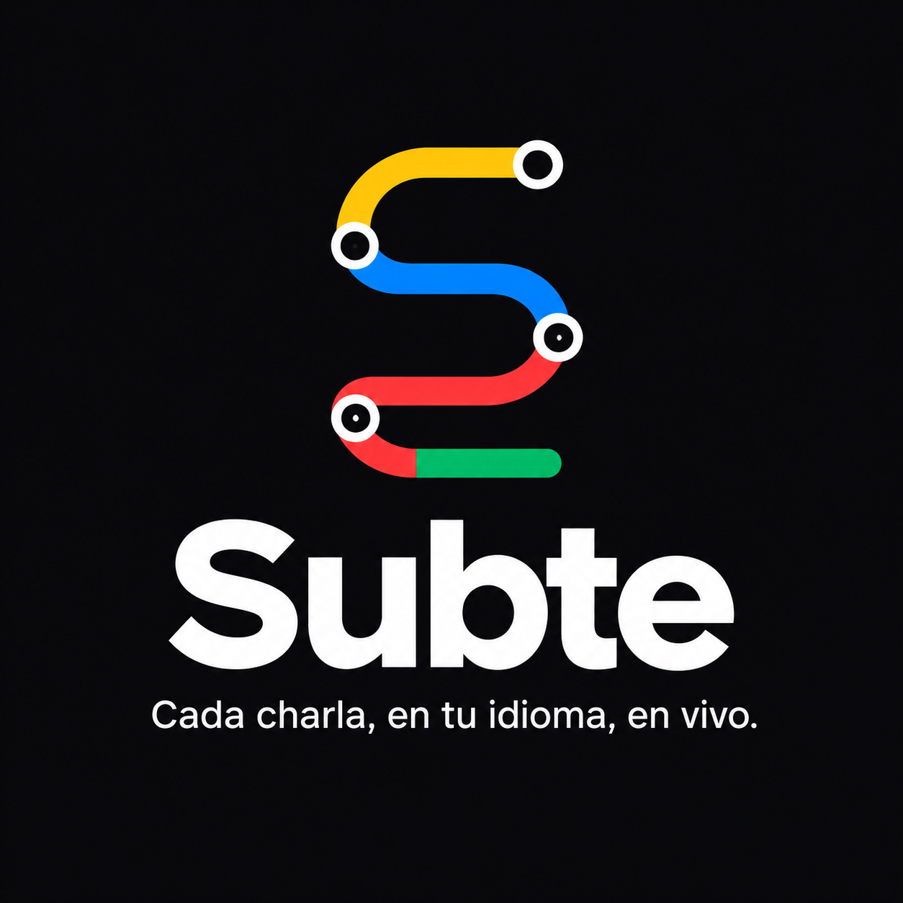

<p align="center">
  
</p>

<h3 align="center">Subtítulos en vivo y traducción para conferencias con muchas salas en paralelo.</h3>

<p align="center">
  <a href="https://subte-nerdearla.vercel.app">Demo</a> · <a href="URL_VIDEO">Video</a> · <a href="docs/DEPLOY.md">Despliega el tuyo</a> · <a href="docs/ARCHITECTURE.md">Arquitectura</a>
</p>

<p align="center">
  <a href="LICENSE"></a>
  
  
  
  
</p>

> **Estado del proyecto:** en desarrollo. Hoy están implementados la base de datos, la agenda pública y el panel de operadores. La transcripción en vivo, la traducción y el recap están en el [Roadmap](#roadmap).

## El problema

Nerdearla tiene más de 30 sesiones en inglés, repartidas en varias salas que corren al mismo tiempo. Para que todo el público pueda seguirlas hacen falta subtítulos en vivo y traducción, y hoy eso se resuelve con herramientas comerciales caras y mucha operación manual. El desafío de la **Vibeathon Nerdearla 2026** es construir una alternativa **open source** que escale a 5, 10 o más escenarios en paralelo y que cualquier conferencia pueda desplegar.

## La solución

**Subte** es una plataforma open source de subtítulos en vivo y traducción EN↔ES para conferencias con muchas salas. La idea se inspira en el subte:

- **Cada sala es una línea**, con su propio color (A, B, C, D…).
- **La agenda es el mapa de la red**: elegís la línea (sala) y te subís a la charla que está sonando.
- **Los capítulos de una charla son estaciones**, y **tus notas son tus paradas** _(planificado)_.

El público no instala nada: abre la web en el celular, elige la sesión y el idioma.

## Funcionalidades

Implementado hoy:

- **Agenda pública** (`/`): todas las salas como líneas de colores, con la sesión actual o próxima destacada, su estado (programada, en vivo, finalizada) y un selector de idioma (español / inglés).
- **Panel de operadores** (`/admin`): acceso con una clave (`OPERATOR_KEY`), alta de salas y alta de sesiones con slug, título, orador, idioma original y glosario de términos.
- **Modelo de datos completo en Supabase** para salas, sesiones, segmentos, traducciones, resúmenes, notas y logs, con Row Level Security.
- **Contratos tipados con zod** (`lib/schemas.ts`) para los eventos en tiempo real, la entrada de segmentos y la salida del LLM.
- **Registro de eventos del servidor** en la tabla `logs`, sin acceso público.
- **Accesibilidad de base**: tipografía Atkinson Hyperlegible, tema oscuro de alto contraste, áreas táctiles de 44 px, formularios que funcionan sin JavaScript.
- **Interfaz en español** con textos en inglés disponibles (`lib/i18n/`).

## Capturas

| Agenda | Sala | Recap |
|---|---|---|
|  |  |  |

_Las capturas de sala y recap se agregarán cuando esas vistas estén implementadas._

## Cómo funciona

Arquitectura objetivo (las piezas marcadas en el [Roadmap](#roadmap) todavía no están en el código):

```
Celular en la sala ──audio PCM──▶ Deepgram (WebSocket directo, token temporal)
        │ frase terminada
        ▼
  API en Vercel ──▶ Supabase Postgres (segments, translations)
        │  └──▶ OpenAI (traducción EN↔ES, resúmenes, capítulos)
        ▼
  Supabase Realtime (un canal por charla)
        ▼
  Celulares del público: subtítulos en su idioma, notas, recap
```

Recorrido de una frase:

1. El celular de la sala capta el audio y lo envía a Deepgram por WebSocket.
2. Deepgram devuelve la frase terminada con sus marcas de tiempo.
3. La estación de sala la envía a la API, que la guarda en `segments` (idempotente por `(session_id, seq)`).
4. La API la traduce con OpenAI y guarda el resultado en `translations`.
5. Supabase Realtime difunde el segmento y la traducción en el canal `live:{sessionId}` a todos los celulares del público.

Detalle completo en [docs/ARCHITECTURE.md](docs/ARCHITECTURE.md).

## Stack

- **Next.js 16** (App Router, Server Actions) + **TypeScript**, desplegado en **Vercel**.
- **Supabase**: Postgres con RLS (Realtime Broadcast, Auth anónima y Storage planificados).
- **Deepgram Nova-3** para transcripción en vivo _(planificado)_.
- **OpenAI API** para traducción, resúmenes y capítulos _(planificado)_.
- **Tailwind CSS v4** + **shadcn/ui**, **zod** para validación.
- Construido con **v0** desde un celular.

## Inicio rápido

1. Hacé un fork de este repositorio.
2. Creá un proyecto en Supabase.
3. Ejecutá `scripts/001_schema.sql`, `scripts/002_rls.sql` y (opcional) `scripts/003_seed.sql`, en ese orden.
4. Importá el repositorio en Vercel.
5. Cargá las variables de [`.env.example`](.env.example) (Supabase + `OPERATOR_KEY`).
6. Desplegá, entrá a `/admin` con tu clave y creá tus salas y sesiones.

Guía completa: [docs/DEPLOY.md](docs/DEPLOY.md).

## Estructura del repositorio

```
app/                 Rutas de Next.js: agenda (/) y panel de operadores (/admin)
  admin/             Página y Server Actions del panel (login, alta de salas y sesiones)
components/
  admin/             Formularios y listado del panel
  agenda/            Tarjeta de sala, badge de estado y selector de idioma
  brand/             Marca de Subte en SVG
  ui/                Componentes de shadcn/ui
lib/
  i18n/              Textos de la interfaz (es, en)
  supabase/          Clientes de Supabase (servidor y service role)
  schemas.ts         Contratos zod compartidos
  operator.ts        Sesión de operador basada en OPERATOR_KEY
  agenda.ts          Consulta de salas y sesiones
  lines.ts           Colores de línea por sala
  log.ts             Escritura en la tabla logs
public/brand/        Logo oficial
scripts/             SQL de Supabase: esquema, RLS y datos de ejemplo
docs/                Documentación
```

## Costos estimados

Valores de referencia; verificá los precios vigentes de cada proveedor.

| Concepto | Costo aproximado |
|---|---|
| Deepgram Nova-3 streaming | US$ 0,0048–0,0058 por minuto (≈ US$ 0,30–0,35 por hora de sala) |
| Crédito inicial de Deepgram | US$ 200 (≈ 570 horas de sala) |
| OpenAI con un modelo pequeño | Centavos por charla |
| Supabase | Plan gratuito para demos (200 conexiones simultáneas); Pro para conferencias grandes |
| Ejemplo: 10 salas × 8 h × 3 días | ≈ 240 h ≈ US$ 80 de transcripción |

## Accesibilidad y privacidad

- **Aviso en sala:** si se transcribe una charla, el público y la persona que presenta deben saberlo. Recomendamos un aviso visible en la sala y en la agenda.
- **Grabación desactivada por defecto:** Subte no guarda audio. Las columnas `audio_url` y `video_url` solo se usan si la organización carga una grabación a propósito (modo replay).
- **Notas privadas:** la tabla `notes` tiene RLS; cada persona solo ve, edita y borra sus propias notas.
- **Legibilidad:** tipografía Atkinson Hyperlegible, texto blanco o amarillo sobre negro y contraste AA como mínimo.

## Roadmap

Planificado y **todavía no implementado**:

- Vista de público de la charla (`/s/[slug]`) con subtítulos en vivo en el idioma elegido. La agenda ya enlaza a esta ruta.
- Estación de sala (`/stage`): captura de audio desde el celular, vúmetro, pausa y reconexión.
- Transcripción en vivo con Deepgram (token temporal, armado de frases, `KeepAlive`, reconexión con backoff).
- Ruta `POST /api/segments` y difusión por Supabase Realtime (`live:{sessionId}` y `live:{sessionId}:interim`).
- Traducción EN↔ES con OpenAI.
- Recap: resumen, ideas principales, capítulos ("estaciones") y transcripción con buscador.
- Notas y marcadores personales con login anónimo, exportables a Markdown.
- Modo replay para demos y charlas grabadas.
- Modo pantalla de sala y ajustes de tamaño de letra.
- Proveedores intercambiables (`SttProvider`, `LlmProvider`).
- Ingesta RTMP/SRT sin navegador (worker Node).
- Alineación automática audio ↔ video.
- Proveedores abiertos o locales (Whisper, Gemma/Gemini, Ollama).
- Edición humana de subtítulos.
- Más idiomas.

## Contribuir

Las contribuciones son bienvenidas. Leé [CONTRIBUTING.md](CONTRIBUTING.md) antes de abrir un PR.

## Licencia

[Apache License 2.0](LICENSE). Copyright 2026 David Gutiérrez y contribuidores de Subte.

## Créditos

- **Autor:** David Gutiérrez ([@davidgutierrezv](https://github.com/davidgutierrezv)).
- Hecho para la **Vibeathon Nerdearla 2026**.
- Construido con [v0](https://v0.app) ([continuar en v0](https://v0.app/chat/projects/prj_GQnHAQA7tWX7Fh3YBo98aPxAwM8S)).
- Servicios: [Vercel](https://vercel.com), [Supabase](https://supabase.com), [Deepgram](https://deepgram.com), [OpenAI](https://openai.com).
- Tipografías: [Atkinson Hyperlegible](https://brailleinstitute.org/freefont) (Braille Institute) y [Space Grotesk](https://fonts.google.com/specimen/Space+Grotesk), ambas con licencia SIL Open Font License.
- Audios de demo: todavía no hay audios incluidos en el repositorio.
